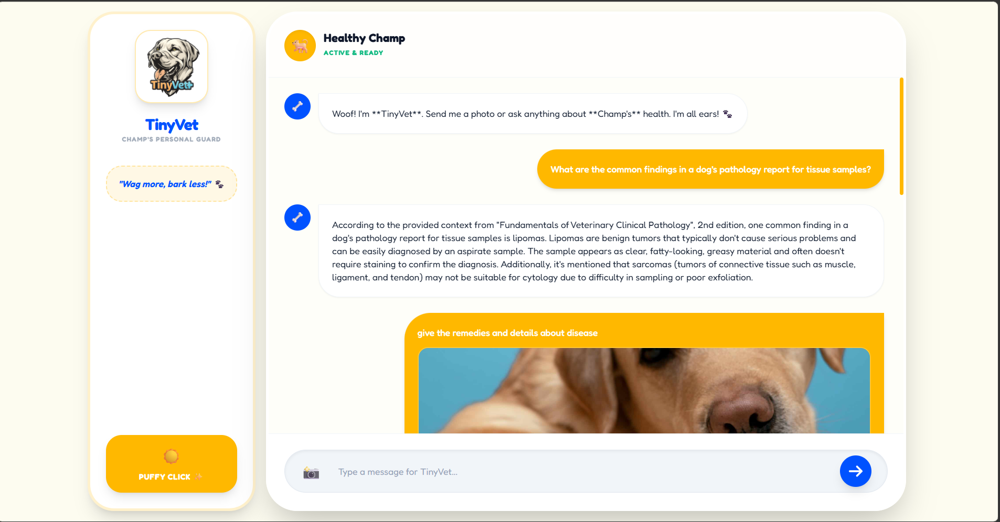
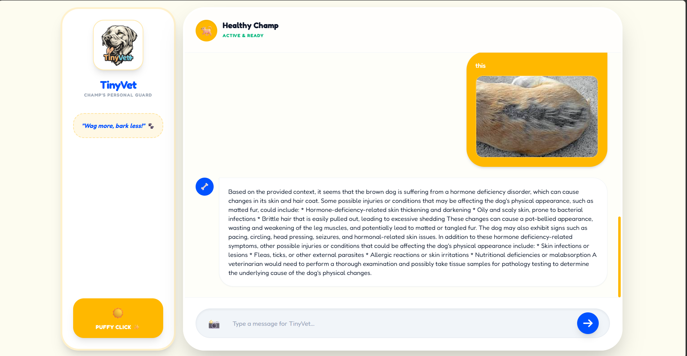
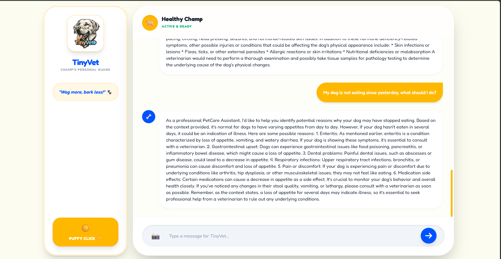

# 🐾 TinyVet: Multimodal AI Pet Assistant for Champ

**TinyVet** is a localized, privacy-first AI health assistant designed to provide instant care guidance for pets. By combining **Computer Vision** and **Retrieval-Augmented Generation (RAG)**, TinyVet can "see" symptoms in photos and "read" professional veterinary documents to provide expert-level advice.


---

## How to run (Quick Start)

Follow the steps below on Windows (cmd). Adjust activation commands for Mac/Linux accordingly.

1. Prerequisites

- Python 3.10+
- Ollama installed and running (https://ollama.com)

2. Pull required models (run in a terminal where Ollama is available):

```bat
ollama pull llama3
ollama pull moondream:1.8b
```

3. Create and activate a virtual environment (project root):

```bat
python -m venv venv
venv\Scripts\activate
```

4. Install Python dependencies:

```bat
pip install -r requirements.txt
```

5. Prepare the knowledge base:

```bat
mkdir data
REM Put your PDF manuals into the data\ folder
dir data
```

6. (Optional) Set a Hugging Face token to avoid rate limits and speed downloads:

```bat
set HF_TOKEN=your_hf_token_here
setx HF_TOKEN "your_hf_token_here"
```

7. Run the app:

```bat
python app.py
```

Open a browser at: http://localhost:5000

Troubleshooting tips
- If you see `ModuleNotFoundError` for langchain imports, run:

```bat
pip install --upgrade langchain langchain-huggingface langchain-ollama
```

- If the app logs a HF Hub warning, provide `HF_TOKEN` as above.
- Make sure Ollama is running and the models are pulled (`ollama ls`).

## Showcase

Screenshots demonstrating TinyVet's multimodal capability (vision + RAG):







=======

---

## How to run (Quick Start)

Follow the steps below on Windows (cmd). Adjust activation commands for Mac/Linux accordingly.

1. Prerequisites

- Python 3.10+
- Ollama installed and running (https://ollama.com)

2. Pull required models (run in a terminal where Ollama is available):

```bat
ollama pull llama3
ollama pull moondream:1.8b
```

3. Create and activate a virtual environment (project root):

```bat
python -m venv venv
venv\Scripts\activate
```

4. Install Python dependencies:

```bat
pip install -r requirements.txt
```

5. Prepare the knowledge base:

```bat
mkdir data
REM Put your PDF manuals into the data\ folder
dir data
```

6. (Optional) Set a Hugging Face token to avoid rate limits and speed downloads:

```bat
set HF_TOKEN=your_hf_token_here
setx HF_TOKEN "your_hf_token_here"
```

7. Run the app:

```bat
python app.py
```

Open a browser at: http://localhost:5000

Troubleshooting tips
- If you see `ModuleNotFoundError` for langchain imports, run:

```bat
pip install --upgrade langchain langchain-huggingface langchain-ollama
```

- If the app logs a HF Hub warning, provide `HF_TOKEN` as above.
- Make sure Ollama is running and the models are pulled (`ollama ls`).

## Showcase

Screenshots demonstrating TinyVet's multimodal capability (vision + RAG):


>>>>>>> 3c9b0d0 (Update README, add screenshots, add .gitignore, fix imports)
